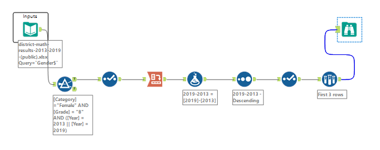

# Alteryx Weekly Challenge Repository - Week XX

## Challenge Overview

In this week's Alteryx Weekly Challenge, we explore the performance of 8th-grade female students in standardized math exams in New York City Public Schools. The goal is to determine the percentage of female students achieving a Level 4 score in both 2013 and 2019. The districts are then ranked based on the improvement in this percentage over the specified years.

## Problem Solving Approach

### Data Source
The data for this challenge is sourced from the [New York City Public School standardized math exams](https://infohub.nyced.org/reports/academics/test-results).

### Steps Taken

1. **Filtering Data:**
   - Extracted data for 8th-grade students.
   - Filtered for female students only.
   - Selected data for the years 2013 and 2019.

2. **Selecting Relevant Columns:**
   - Focused on the district, year, and the percentage of female students achieving a Level 4 score.

3. **Cross Tabulation:**
   - Utilized the Cross Tab tool to pivot the data, making the years (2013 and 2019) headers.

4. **Calculating Improvement:**
   - Formulated a new column to calculate the improvement percentage (2019 - 2013).

5. **Sorting Data:**
   - Sorted the data in ascending order based on the improvement percentage.

6. **Sampling Top Districts:**
   - Extracted the top 3 rows to showcase the districts with the most significant improvement.

## Project Structure

The project directory is organized as follows:

- **Input Data:**
  - [data_source.csv](data_source.csv) - Raw data file containing standardized math exam results.

- **Alteryx Workflow:**
  - [women_of_analytics.yxmd](women_of_analytics.yxmd) - Alteryx workflow file demonstrating the solution to the challenge.

- **Output Data:**
  - [output_results.csv](output_results.csv) - Resulting data file with calculated improvement percentages.

## How to Use This Repository

1. **Clone the Repository:**
   - Clone this repository to your local machine.

2. **Open Alteryx Workflow:**
   - Open the Alteryx workflow file [women_of_analytics.yxmd](women_of_analytics.yxmd) using Alteryx Designer.

3. **Run the Workflow:**
   - Execute the workflow to obtain the results.

4. **Review Results:**
   - Examine the resulting [output_results.csv](output_results.csv) file to see the top districts with the most significant improvement in the percentage of female students achieving a Level 4 score.

## Next Steps

Feel free to explore the Alteryx workflow, modify parameters, or adapt the solution to fit your specific needs. Contributions and improvements to the workflow are welcome!

Happy Analyzing! 🚀📊